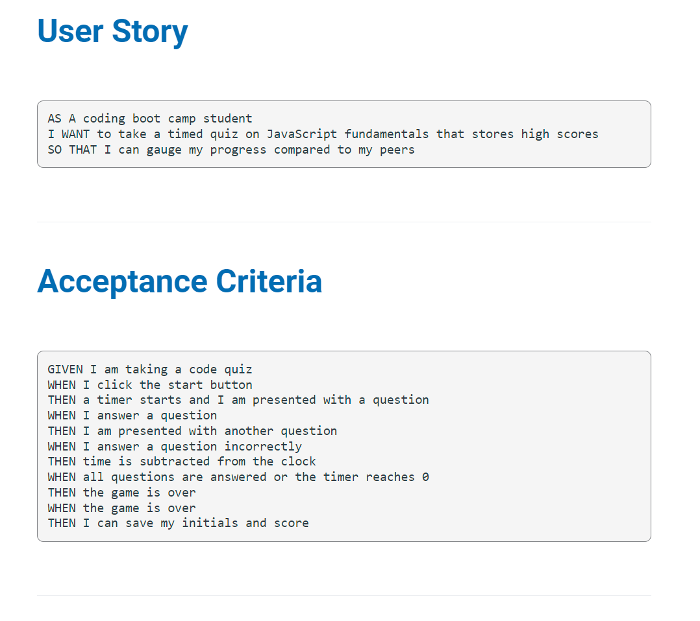
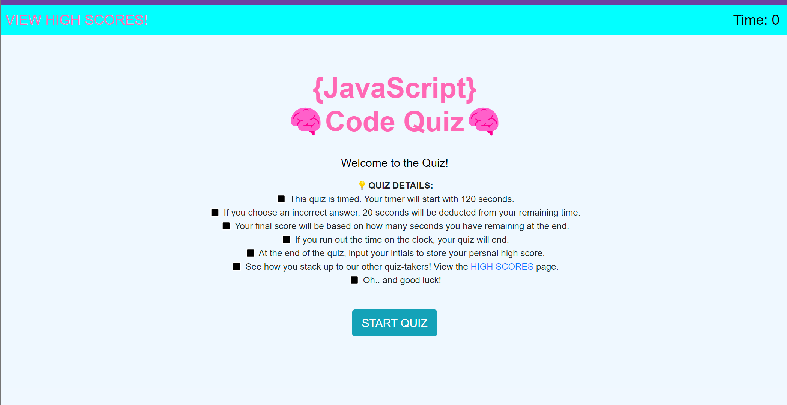

# JavaScript-- CODE QUIZ
code-quiz-2 (challenge #4 -- OSU coding bootcamp) -- 2nd atempt
- Had to take the code in a different direction for this second attempt, the initial attempt brought me to a roadblock that I could not surpass. Therefore, I started completely over. I am now pleased with my final result.

## Screenshots

## Sources
- MDN Webdocs
- stackoverflow.com
- The OSU coding bootcamp (modules/lessons, classes, etc.)
- AskBCS Learning Assistants in Slack
- ... and last, but certainly not least -- Google.com
